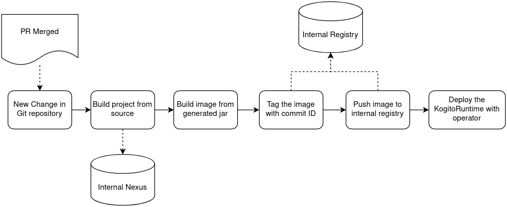

# Kogito CI/CD Recipes with Tekton

_Wait! Don't you know what's Kogito? Please take a look at [http://kogito.kie.org/](http://kogito.kie.org/) before going any further!_

In this repository we gather some recipes for you to build and deploy your Kogito and supporting services on Kubernetes and OpenShift with [Tekton](https://tekton.dev/).

**Do not try to use these recipes in production "as is".**

## Required Operators

Please make sure that all these operators are installed and running on your cluster before proceeding:

- [Tekton](https://tekton.dev/): all the recipes are based on Tekton Pipelines
- [Nexus Operator](https://operatorhub.io/operator/nexus-operator-m88i): for caching your Java libraries
- [Kogito Operator](https://operatorhub.io/operator/kogito-operator): to help you manage your deployed Kogito services

Some recipes might require other operators to provide infrastructure for serverless, persistence or eventing.
The recipe should list these requirements if needed.

## Recipes

### Build and deploy a stateless Kogito service

In this recipe you will learn the basics of a custom Kogito service build and deploy using the [images provided by the Kogito Team](https://quay.io/organization/kiegroup) and the Kogito Operator. Since it's very basic, it will be referenced and used by other pipelines.

See the proposed flow below:

After a successfully merged pull request (PR), the pipeline got notified with the change and start the build.

To speed up the build, the pipeline will use a shared Nexus server mirroring Maven central and any other repositories needed by the build process.

The image will be tagged and pushed to the internal Image Registry, and finally the Kogito service should be deployed.

The image tagging is necessary to make it easy to rollback to a previous version.

#### Environment Setup

<!-- TODO: how do I get Nexus running and the internal registry enabled? Must consider minikube installations always -->

#### Tekton Pipeline

<!-- TODO: anything related to the tekton pipeline. we are expecting lots of yaml files here? :D -->

## Further Reading

<!-- Add any article that could help the reader with the content listed in here -->

- [Deploying a custom Kogito service on Kubernetes with Kogito Operator](https://medium.com/kie-foundation/deploying-a-custom-kogito-service-on-kubernetes-with-kogito-operator-be031a2fba94)
- [Speeding up your build in the cloud with Nexus Operator](https://ricardozanini.medium.com/speeding-up-your-build-in-the-cloud-with-nexus-operator-d063bd7d192b)
