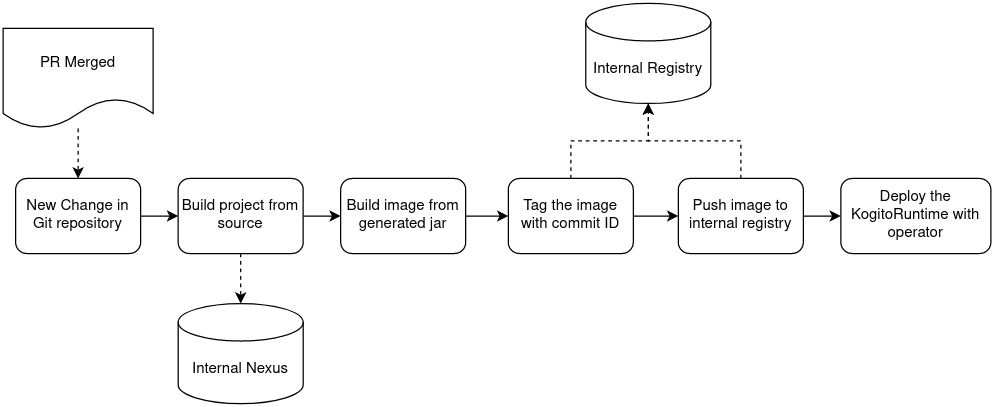

# Build and deploy a stateless Kogito service

In this recipe you will learn the basics of a custom Kogito service build and deploy using the [images provided by the Kogito Team](https://quay.io/organization/kiegroup) and the Kogito Operator. Since it's very basic, it will be referenced and used by other pipelines.

See the proposed flow below:

After a successfully merged pull request (PR), the pipeline got notified with the change and start the build.

To speed up the build, the pipeline will use a shared Nexus server mirroring Maven central and any other repositories needed by the build process.

The image will be tagged and pushed to the internal Image Registry, and finally the Kogito service should be deployed.

The image tagging is necessary to make it easy to rollback to a previous version.

## Environment Setup

<!-- TODO: how do I get Nexus running and the internal registry enabled? Must consider minikube installations always -->

## Tekton Pipeline

<!-- TODO: anything related to the tekton pipeline. we are expecting lots of yaml files here? :D -->